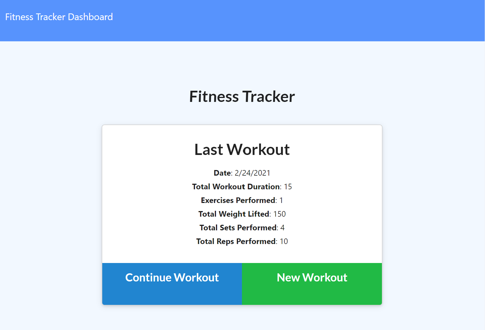
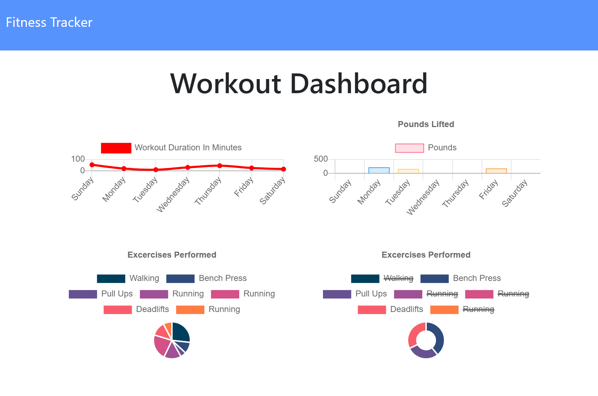

# workout-tracker


## Description
    
Workout Tracker is a web application that lets anyone create and track daily workouts. Multiple exercises can be logged for any given day, with tracking of the exercise details such as type, weight, sets, reps and duration. Additionally, cardio exercises can track total distance.

This application's front end code was already provided. However, the Mongo database along with the Mongoose schema and routes with Express still needed to be created.

<a href="https://guarded-ocean-13572.herokuapp.com/" target="_blank"></a>

<a href="https://guarded-ocean-13572.herokuapp.com/" target="_blank"></a>

## Content

* [GitHub Repository](https://github.com/Rudy-Menjivar/workout-tracker/)

* [Heroku Site](https://guarded-ocean-13572.herokuapp.com/)

* [Installation](#installation)

* [Usage](#usage)

* [Contributing](#contributing)

* [Tests](#tests)

* [Questions](#questions)

## Installation

Run the following command to install the required dependencies:
```
npm i
```
  

## Usage

Setup Mongoose Schema:
```
npm run seed
```

Run this command to invoke this application:
```
npm run watch
```
  

## Contributing
    
Any community contributions will help in achieving this project's success, so any help is greatly appreciated.
    
To participate in this project, please review the following guidelines:
    
1. Create a branch for your update (after forking and cloning)
    
   `git checkout -b <branchName>`
    
2. Make changes or additions to new or existing file & stage it
    
   `git add <fileName.ext>`
    
3. Commit your file by adding comments about code enhancements
    
   `git commmit -m <your code comments>`
    
4. Push your changes with your remote branch name
    
   `git push -u origin <branchName>`
    
5. Finally, submit [feature requests and bugs](https://github.com/Rudy-Menjivar/workout-tracker/issues) and open a [pull request](https://github.com/Rudy-Menjivar/workout-tracker/pulls)
  

## License

Copyright (c) Rudy-Menjivar. All rights reserved.
    
Licensed under the [MIT](./LICENSE.txt) license.
  

## Questions
  
If you have any questions, then feel free to contact me at rudy.menjivar@gmail.com. You may also access my complete work at [GitHub](https://github.com/Rudy-Menjivar).